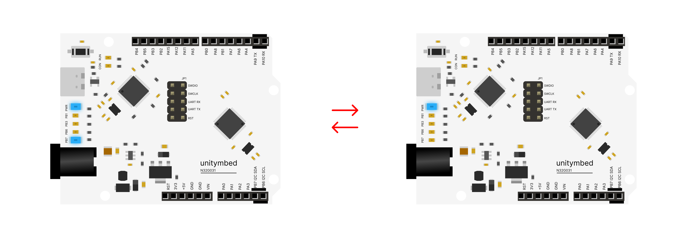

# N32G031_LED_BLINK — GPIO Hello World

An introductory project designed to teach basic GPIO (General Purpose Input/Output) control using the **N32G031** microcontroller. This "Hello World" of hardware serves as an excellent foundational learning tool for beginners and students to understand digital outputs, basic circuit wiring, and timing functions. This project is fully optimized for cross-platform workflows using UnityMbed.

---

## Wiring

No external wiring is required! This project uses the **built-in LED** on the N32G031 development board.

| Component | Pin | N32G031 | Notes |
| :--- | :---: | :---: | :--- |
| **On-board LED** | 💡 | **PB7** | Pre-wired on the development board |

---

## Behaviour & Execution

Once powered on and flashed with the code, the microcontroller will execute the following loop continuously:
1. Set PB7 to **HIGH** (LED turns ON).
2. Hold this state for **500 milliseconds**.
3. Set PB7 to **LOW** (LED turns OFF).
4. Hold this state for **500 milliseconds**, then restart the cycle.

---

## Hardware Setup & Troubleshooting

* **Plug and Play:** Since the LED is built into the board, you only need to connect the board to your computer via USB. No breadboards, resistors, or jumper wires are needed.
* **Not Blinking?:** Ensure the board is properly powered and the flash process completed successfully without errors.

---

## Learning & AI Extension Ideas

* **Digital Outputs:** Understand the concepts of HIGH (ON) and LOW (OFF) states in digital electronics.
* **The Speed Challenge:** Encourage students to modify the delay times inside the code.
  * What happens if they change the delay to `50` milliseconds? Does it look like a strobe light?
  * What happens if the ON time is `100` but the OFF time is `2000`?
* **Heartbeat Effect:** Can they write a sequence of delays to make the LED blink like a human heartbeat (ba-bum... ba-bum...)?

---

## Build and Flash (Universal Cross-Platform)
1. **Open Project:** Open this project folder directly in the IDE.
2. **Build & Flash:** Simply click the **Build** and **Flash** buttons on the interface.

---
Part of the [UnityMbed](https://github.com/GRB-UNITYMBED) N32G031 example set.
